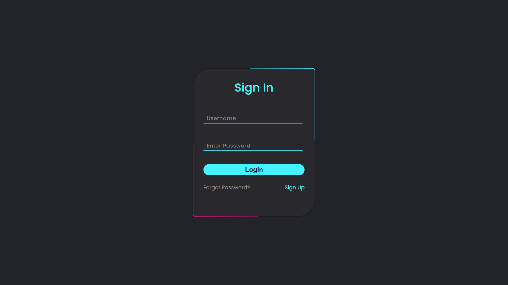
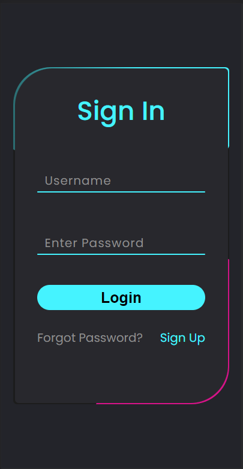

# Responsive Animated Login Form

### Link

- [Live Site](https://linen220-animated-form-login.netlify.app/)

 

## Screenshot

<h3>Desktop Screen</h3>

<h3>Mobile Screen</h3>

 

## Built with

-    
-    

 

## Useful Resources

- [Youtube](https://www.youtube.com/watch?v=8OgMWKo0T0c&list=LL&index=14) - Coding Programming's channel

 

## Contact Me

- Frontend Mentor - [@Linen220](https://www.frontendmentor.io/profile/Linen220)
- Github - Linen220

 